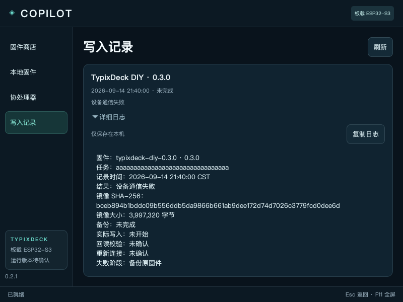
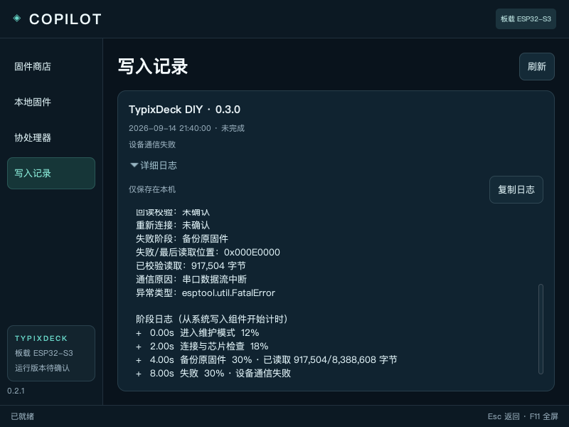
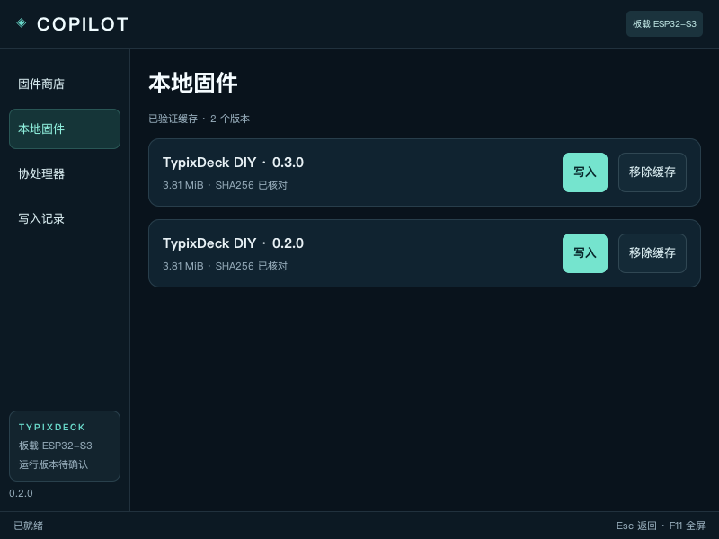

# TypixDeck Copilot

TypixDeck 板载 ESP32-S3 的固件商店，运行在同一设备的 Raspberry Pi 主系统上，通过 Launcher 全屏启动。

**0.2.1：写入记录支持展开详细日志与复制**。查看阶段耗时、读取进度、失败位置和脱敏异常；旧记录显示已经保存的信息。

所有目录固件统一「写入」。选择版本后点击写入，确认后自动复用缓存或下载校验，继续系统授权与写入。无需单独下载。启动时验证本仓库的签名固件目录，离线时使用已验证缓存或随包目录。

已镜像官方 2026-09-10、2026-08-21、2026-08-15、2026-08-14 四个版本，保留原文件及固定哈希。官方条目和 DIY 均从本仓库 `firmware/` 下载，原有缓存直接复用。来源与版本清单见 [官方固件目录](firmware/typixdeck-official/README.md)。

已收录 [DIY 0.3.0 候选与界面预览](firmware/typixdeck-diy/0.3.0/README.md)：全新紧凑卡片界面、真实传感器状态、一小时曲线、黑白琴键、自定义 RGB 与亮暗背景，保留树莓派、时钟、Wi-Fi 与 NTP。0.2.0 继续保留。DIY 候选尚未真机验证；与其他已签名目录版本一样可以发起写入，仍执行完整板级检查。

刷写仍处于实验阶段：官方 2026-09-10 镜像曾实际写入，但独立读回中断；0.1.3 再次复现备份通信失败，完整刷写链路尚未通过 CM4 验收。本轮检查到一次 DIY 尝试在备份现有固件的 `0x000E0000` 位置通信中断，尚未开始擦写。0.2.1 增强诊断记录，通信故障仍未解决。

## 使用

选择固件 → **写入** → 确认。已有缓存会直接复用，缺少时自动下载；确认、进度和结果都在同一窗口。完整写入会重置协处理器设置，写入中请勿切换、拔线或断电。

**本地固件**仅管理之前缓存的版本：可再次写入或移除缓存。带有效签名凭据的旧版本，即使后来不在在线目录中，也可离线使用；移除缓存不会删除设备备份或写入记录。

在「写入记录」展开「详细日志」，可查看并复制该任务的诊断信息；任务结束后也可直接点击「查看日志」。新任务保留有界的阶段记录，仅存于本机；旧记录缺失的阶段不会补造。

结果分别记录备份、实际写入、读回校验与重新连接。旧官方固件没有运行版本握手，因此完成后仍显示“运行版本待确认”。恢复方法和授权边界见 [真实写入说明](docs/REAL-WRITER.md)。

## 安装与构建

目标系统：官方 Raspberry Pi OS Trixie ARM64。程序使用 GTK3 + PyGObject。

已配置 `typixdeck/store` 源的设备：打开 Store → 刷新 → 搜索 **Copilot** → 安装或更新。更新完成后关闭旧 Copilot，再从 Launcher 重新打开；在“全部”或“自研”分类中可看到 DIY 固件。0.1.3 及更早客户端只有内置目录，单独更新 GitHub 固件文件无法让旧客户端发现 DIY。

完整包及签名目录见 [Store debs](https://github.com/typixdeck/store/tree/main/debs)。本仓库的 [app.json](app.json) 提供标准应用信息、完整包版本/SHA-256 和截图索引。

```sh
python3 tools/build-deb.py
sudo apt install ./dist/typix-copilot_0.2.1-1_arm64.deb
install -m 644 /usr/share/applications/typix-copilot.desktop ~/Desktop/typix-copilot.desktop
```

设备匹配依据 `/etc/typix-copilot/board.json` 的已审核板载 USB 拓扑和运行时枚举。配置不匹配时拒绝写入；不同计算模块/板修订须重新核对连接与恢复路径。

```sh
PYTHONPATH=src python3 -m unittest discover -s tests -v
python3 tools/check-firmware-index.py
python3 tools/check-live-gtk.py
```

## 本机预览

Mac 可双击 [Preview.command](Preview.command)，或运行 `./start-preview.sh`。这是显式离线预览，持续标明“不写入芯片”；正式 deb 默认启动真实模式。

以下为 0.2.1 日志界面，使用测试记录在本机 GTK 渲染，未执行真机写入：




以下为 0.2.0 实际 GTK 界面在本机渲染的截图，使用测试缓存和控制器，未执行真机写入：




以下为 CM4 真机 0.1.3 软件界面截图；固件写入结果与限制见上方说明。


## 项目组织

| 路径 | 内容 |
| --- | --- |
| `app.json` | Store 应用识别与完整 deb 发布描述 |
| `src/typix_copilot/` | 原生界面、缓存、目录、板载发现及写入事务 |
| `packaging/` | 桌面入口、Polkit 授权和板载配置 |
| `tools/` | deb 构建、预览部署与 GTK 验证 |
| `tests/` | 文件、缓存、授权控制器和替身硬件事务测试 |
| `docs/` | 产品设计、固件格式、实际写入与截图 |
| `firmware/` | 在线 JSON 索引、按项目/版本组织的 bin 与发布说明 |
| `dist/` | 本地构建 deb，不提交缓存或设备备份 |

软件 Store 分发 Copilot 的 deb，Copilot 管理 ESP32-S3 固件。当前官方方案是重新刷写单 factory 分区，不是多固件常驻引导。

固件发布步骤见 [firmware/README.md](firmware/README.md)。后续新增固件提交版本目录、更新索引并签名后，0.2.0 客户端刷新即可发现和发起写入，无需为每个版本重打 Copilot deb。签名仅授权目录中的准确镜像，不允许跳过板级、备份和回读校验。

硬件依据：[官方固件源码](https://github.com/TypixNode/TypixDeck-esp32s3-firmware)、[官方电路设计](https://github.com/TypixNode/TypixDeck-schematics)。实现范围见 [固件来源](docs/ARTIFACT-SOURCES.md)；扩展包格式见 [协议草案](docs/FIRMWARE-FORMAT.md)。
