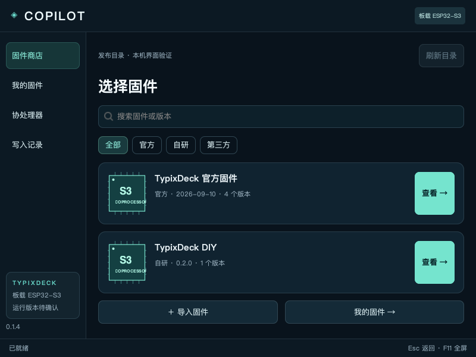
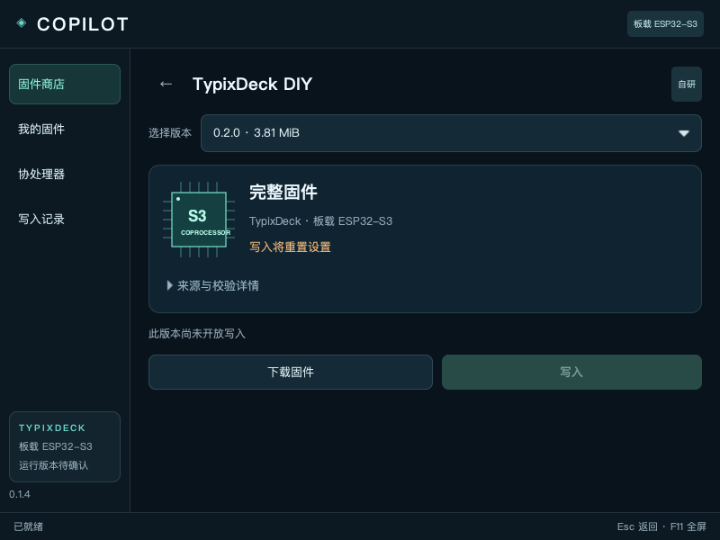
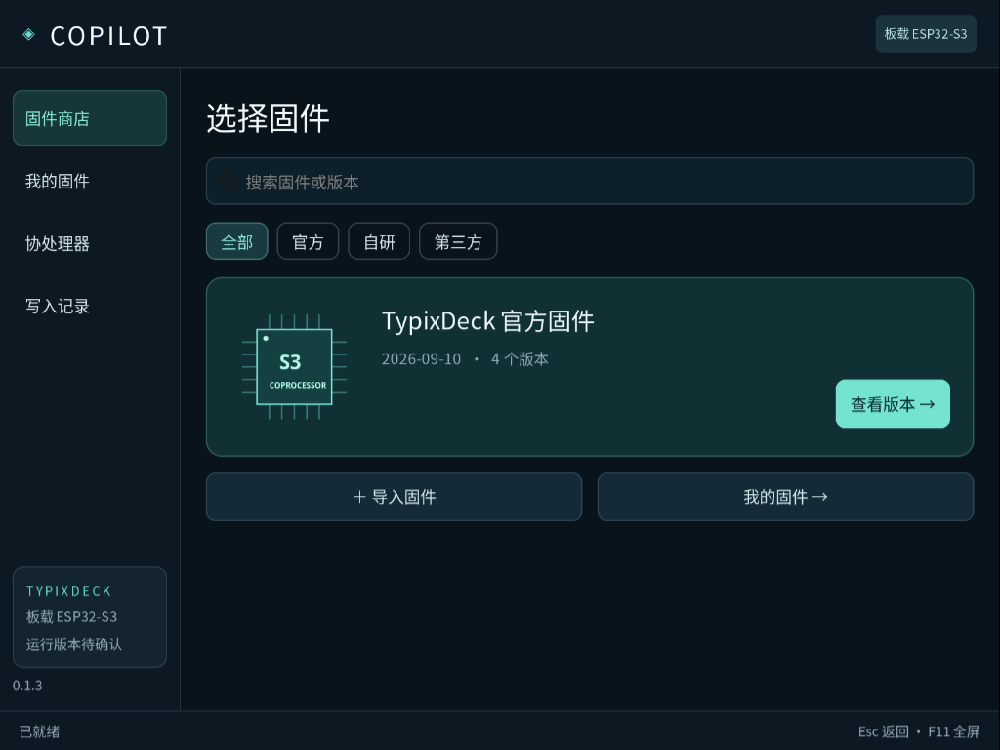
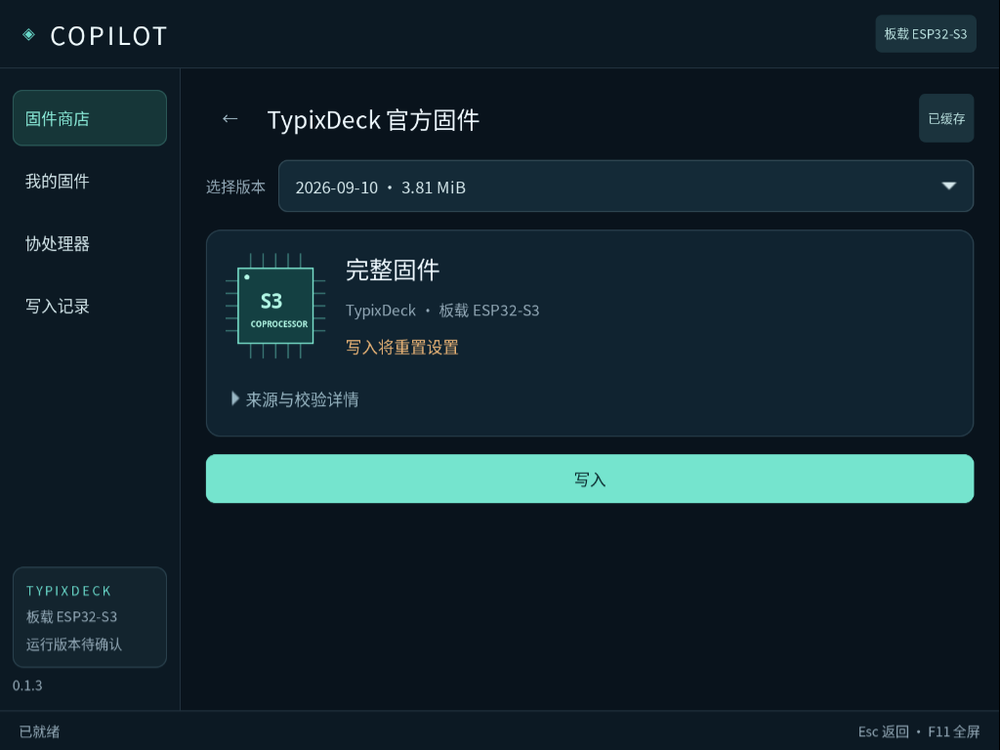

# TypixDeck Copilot

TypixDeck 板载 ESP32-S3 的固件商店，运行在同一设备的 Raspberry Pi 主系统上，通过 Launcher 全屏启动。

**0.1.4 新增在线固件目录**：启动时读取本仓库的 [`firmware/index.json`](firmware/index.json)，按来源展示版本，并下载对应 bin。刷新失败时保留离线目录，缓存文件每次复用都核对大小、SHA-256 和镜像结构。

已收录 DIY 0.2.0 候选：传感器、树莓派、应用、设置四页，含本地小乐器、时钟、Wi-Fi 与 NTP。该候选尚未真机验证，当前提供下载与检查；在线目录不会自动授予写入权限。

刷写仍处于实验阶段：官方 2026-09-10 镜像曾实际写入，但独立读回中断；0.1.3 再次复现备份通信失败，完整刷写链路尚未通过 CM4 验收。请暂停重复刷写。

## 使用

选择固件 → **写入** → 确认。已有缓存会直接复用，缺少时自动下载；确认、进度和结果都在同一窗口。完整写入会重置协处理器设置，写入中请勿切换、拔线或断电。

结果分别记录备份、实际写入、读回校验与重新连接。旧官方固件没有运行版本握手，因此完成后仍显示“运行版本待确认”。恢复方法和授权边界见 [真实写入说明](docs/REAL-WRITER.md)。

## 安装与构建

目标系统：官方 Raspberry Pi OS Trixie ARM64。程序使用 GTK3 + PyGObject。

```sh
python3 tools/build-deb.py
sudo apt install ./dist/typix-copilot_0.1.4-1_arm64.deb
install -m 644 /usr/share/applications/typix-copilot.desktop ~/Desktop/typix-copilot.desktop
```

设备匹配依据 `/etc/typix-copilot/board.json` 的已审核板载 USB 拓扑和运行时枚举。配置不匹配时拒绝写入；不同计算模块/板修订须重新核对连接与恢复路径。

```sh
PYTHONPATH=src python3 -m unittest discover -s tests -v
python3 tools/check-firmware-index.py
python3 tools/check-live-gtk.py
```

## 本机预览

Mac 可双击 [Preview.command](Preview.command)，或运行 `./start-preview.sh`。这是显式离线预览，持续标明“不写入芯片”；正式 deb 默认启动真实模式。

以下为 0.1.4 本机 GTK 界面，载入本仓库发布索引，未执行写入：




以下为 CM4 真机 0.1.3 软件界面截图；固件写入结果与限制见上方说明。




## 项目组织

| 路径 | 内容 |
| --- | --- |
| `src/typix_copilot/` | 原生界面、缓存、目录、板载发现及写入事务 |
| `packaging/` | 桌面入口、Polkit 授权和板载配置 |
| `tools/` | deb 构建、预览部署与 GTK 验证 |
| `tests/` | 文件、缓存、授权控制器和替身硬件事务测试 |
| `docs/` | 产品设计、固件格式、实际写入与截图 |
| `firmware/` | 在线 JSON 索引、按项目/版本组织的 bin 与发布说明 |
| `dist/` | 本地构建 deb，不提交缓存或设备备份 |

软件 Store 分发 Copilot 的 deb，Copilot 管理 ESP32-S3 固件。当前官方方案是重新刷写单 factory 分区，不是多固件常驻引导。

固件发布步骤见 [firmware/README.md](firmware/README.md)。后续新增固件只需提交版本目录并更新索引，无需重打 Copilot deb 即可在刷新后发现；开放该固件的真实写入需要另行审核并更新写入组件。

硬件依据：[官方固件源码](https://github.com/TypixNode/TypixDeck-esp32s3-firmware)、[官方电路设计](https://github.com/TypixNode/TypixDeck-schematics)。实现范围见 [固件来源](docs/ARTIFACT-SOURCES.md)；扩展包格式见 [协议草案](docs/FIRMWARE-FORMAT.md)。
