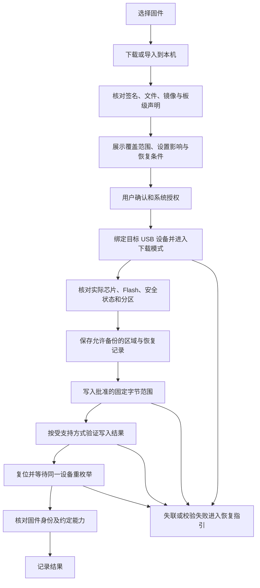
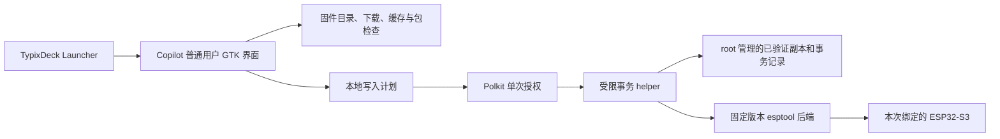

# Copilot 产品与实现建议

## 定位与范围

Copilot 是**面向 TypixDeck 板载 ESP32-S3 协处理器、带写入功能的 Firmware Store**。用户在树莓派主系统上浏览固件项目、选择版本并将编译产物写入同一设备的板载协处理器，实现固件快速切换。

Copilot 使用 GTK3/PyGObject，打包为 deb，TypixDeck Launcher 通过标准 `.desktop` 启动它；Typix Store 负责安装/升级 Copilot deb。固件项目、版本和编译产物由 Copilot 独立管理，固件写入由受限维护后端完成。

目标设备固定为当前 TypixDeck 的板载协处理器。运行时按板级配置、内部 USB 拓扑和本次枚举关系核对，不能仅按芯片型号或第一个串口选择目标。外接 ESP32 开发板不进入默认写入流程；无法确认板载目标时保留固件浏览和下载，停止写入。

## 核心使用流程与首版目标

**选固件项目 → 选版本 → 写入 → 确认 → 自动复用缓存或下载 → 授权写入并验证。**

0.2.0 已实现：所有签名目录版本共用一个写入入口。「本地固件」只管理有效缓存版本，支持写入和移除，不提供单独下载或导入文件入口。下面的扩展协议、握手和恢复目标需与 [当前真实后端](REAL-WRITER.md) 的验收状态一起阅读。

商店条目对应一个固件项目，条目下管理版本和不可变的实际产物。官方、自研和第三方是来源分类，使用相同的下载、检查、缓存及写入流程。GitHub Release、仓库内 `release/` 文件和本地构建输出通过接入描述转换为内部记录；接入详情见 [固件来源与产物](ARTIFACT-SOURCES.md)。

首个完整版本必须让用户在 CM4 上完成一次已审核固件切换及切回恢复版本。内部开发依次实现固件库、预检和写入后端；只有浏览/预览的开发版本应明确标为开发预览，不计作完整 Firmware Store 交付。首版消费已经编译好的文件，编译工作继续由固件项目或其 CI 完成。

已下载的版本应直接复用本地校验副本；首次接入的项目需建立板级适配与写入描述，后续选择已审核版本时不要求用户反复填写端口、地址或命令。确认页优先展示用户需要决定的内容：所选版本、设置是否重置、功能变化和恢复方式，技术细节可展开。

可借鉴 M5Launcher 的固件收藏、版本展示、本地导入、备份和恢复体验。M5Launcher 的 ESP32 常驻启动器、OTA 槽位和动态分区机制不直接套用到 TypixDeck 当前单应用布局。[M5Launcher 项目原理](https://github.com/bmorcelli/Launcher/wiki/Explaining-the-project)

第一版以官方 Raspberry Pi OS ARM64 和 CM4 真机验收。对其他主模块按 USB、内存、存储、权限与显示能力探测，不能仅依产品型号放行。固件适配必须另查 ESP32 板级版本、芯片、安全状态和 Flash 布局。

## 主要页面

| 页面 | 用户能做什么 |
| --- | --- |
| 固件商店 | 按项目浏览官方 / 自研 / 第三方固件；搜索、选版本并发起写入 |
| 本地固件 | 查看之前缓存版本、再次写入或移除缓存 |
| 固件详情 | 看截图、功能、版本、源码与许可证，检查适配、包签名和设置影响 |
| 板载协处理器 | 显示本机 TypixDeck 的运行/下载模式与接口状态；版本只有可靠握手确认后才标为“当前” |
| 写入任务 | 看目标、版本、覆盖范围和恢复包，确认后授权；观察明确的阶段进度 |
| 恢复与记录 | 恢复已审核官方包、查看本机上次结果、导出脱敏诊断；提供失联操作指引 |

全屏布局适合约 800×600 逻辑分辨率；Tab / 方向键 / Enter 可完成选择，Esc 返回。写入使用同一窗口内的确认页，不能由列表中的单次 Enter 直接触发。未写入阶段可以取消，正在写 Flash 时必须按工具支持的安全边界处理；界面不提供强杀式“取消”。

## 三类固件和信任方式

1. **官方固件**：固定源码 commit、构建来源和完整校验值，保存至少一个离线恢复版本。
2. **自研固件**：导入本地 `.bin`、ESP-IDF 构建输出或自研仓库的发布产物；由接入描述补齐统一 manifest，列出板级适配与电源/屏幕/音频能力变化，保留构建来源。
3. **第三方固件**：同样的格式，附作者、许可证、源代码/来源、硬件支持和恢复条件。可信发布者签名与“已在目标板验证”分别展示，不能把签名等同于兼容性。

当前不提供普通用户文件导入；自研或第三方产物通过仓库签名目录发布，再由统一流程使用。来自固件包的 shell 脚本、hook 或任意命令一律不作为执行步骤。

统一 manifest 可以由发布者提供，也可以由 Copilot 的已审核源适配描述生成。上游尚未提供签名时，应明确区分“固定来源及文件校验”“维护者审核”和“发布者签名”，不把缺少专用 bundle 或上游签名等同于无法接入现有官方项目。

## 刷写事务

写后字节校验、同一设备重新枚举和运行固件身份确认分别记录。旧固件没有版本握手时显示“写入已验证，运行版本待确认”，并保留“上次写入”记录；不能仅凭 USB 产品名断言当前正在运行哪个版本。

普通“预览计划”只读取文件和系统枚举，不主动打开串口、发重启命令或用 esptool 自动复位。读取真实 Flash 分区可能需要进入下载模式，属于已确认事务的一部分。最终设备读数与预览不符时停止写入并重新形成计划，不能偷偷改地址、扩大覆盖范围或忽略容量冲突。

进入下载模式后设备节点可能改变，必须按同一物理 USB 拓扑和本次枚举关系追踪目标；多设备或映射不确定时停止。不能使用“第一个 `/dev/ttyACM*`”或全局某个 VID/PID 的存在作为目标证据。设备唯一标识不写入公开目录、不上传。

## 架构与权限

GUI 不保留 root。helper 仅接受已校验 bundle 和目标句柄/受限设备标识，独立检查普通用户输入、不可变副本、签名、地址范围、芯片和板级策略。执行固定参数模板，禁止把 manifest 拼成 shell。授权用于一次具体计划；新版本、目标变化、额外擦除或分区改动需要重新确认。

写入前将目标计划、校验值与恢复点记录到本机并落盘；记录不含账号、密钥、完整 NVS 或设备唯一标识。取消/断电/USB 断开后，下一次启动先显示未完成任务状态，不自动重新烧写。单应用分区失败不能承诺自动回滚。

恢复备份保存在本机私有目录，权限 0600；NVS 可能含个人配置。安全启动、Flash 加密或受保护 eFuse 状态与预期冲突时停止，第一版不修改安全 eFuse、不关闭安全保护。不能假设原始 Flash 备份可在不同安全状态或不同设备上恢复。

## 官方固件的板级契约

ESP32-S3 负责的不只是一个独立小程序。替换固件前，需要验证 CM 电源保持/安全关机链、屏幕与触摸 MUX、USB 音频/CDC 以及恢复入口。自研固件应复用审核后的板级初始化和维护协议，再增加功能。

电路存在安全关机相关信号，当前固件没有可调用的完整安全关机或保活 API。AW9523 的配置/输出初始化顺序及热复位残留状态会影响 CM 供电。板型配置必须记录这些约束，不能以自定义固件的“支持关机”声明替代证据。

第一轮工程试验应确认：ESP32 进入 ROM 下载模式、重启和刷写期间，CM4 是否持续供电；从第三方固件恢复时是否仍有 CDC 魔法命令；若没有，用户是否能通过经实物确认的 BOOT/RESET 进入 ROM。硬件按钮标号在上游不同文档存在冲突，界面指引应在实机核验后冻结。Pi 的 USB Host 通路与 Pi 可控制复位是两种能力，前者成立不能证明后者。

0720 的外部 USB6 与内部 Hub 上行并联；Pi 自刷保留 Host 路径，外部电脑恢复则先按已验证硬件说明隔离 Pi Host，不能同时连接两个 Host。USB4/CM Device/CM BOOT 属于主系统恢复，和 ESP32 维护分开。SW8 没有已知软件控制端点，Copilot 不承诺自动切换它。

固件缺少 USB 音频、屏幕控制或维护命令时，要在详情明确标记“切换后暂不可用”，不能以安装成功的进度条掩盖这些变化。若存在掉电、无法恢复或未经证实的板级风险，该固件不进入普通用户可写列表。

## 建议的开发顺序

| 阶段 | 可交付结果 | 必须通过的验收 |
| --- | --- | --- |
| 0.1 完整切换闭环 | 可安装 deb；官方项目产物与本地自研/第三方导入、版本缓存、板级检查、授权写入、验证、切回官方恢复版本 | CM4 上完成审核固件的实际写入和切回；验证供电连续性、重枚举、写后检查及失败恢复；覆盖坏包、低存储、网络失败、取消和目标不明确 |
| 0.2 来源与发布接入 | 多项目订阅、GitHub Releases/仓库目录更新发现、维护者接入描述、发布者签名及版本历史 | 发现新版本只入库提示；字节/布局/适配变化必须重新核对；本地缓存可离线切换 |
| 0.3 切换体验完善 | 常用组合、版本间功能与设置变化对比、更多已验证板级/固件组合 | 缩短重复下载和重复输入步骤；保留每次实际写入的确认、验证与恢复条件 |
| 后续启动器固件 | 如确有需求，再设计 ESP32 常驻恢复/多应用启动方案 | 独立修改分区与引导设计；处理4MiB字体占用和恢复镜像；不沿用单槽回滚假设 |

第一版围绕“选固件 → 看清变化 → 写入 → 能恢复”交付。完整切换默认使用逐产物确认的合并镜像；仅应用更新在布局、字体及设置兼容已证明时开放，不作为任意两个项目间切换的默认捷径。

## 当前尚待实际验证

- 上游批量脚本的使用记录不能替代 CM4 在同一设备内自刷 ESP32 时的供电与复位验收。
- 暂无可信的版本/构建 ID 标准查询，应给未来自研固件补只读 `INFO` / `CAPS` 握手；旧固件显示“身份未确认”，历史写入记录只代表上次写入。
- 应用更新保留 NVS/字体的条件、官方镜像的逐版本差异、第三方板级兼容性需要按具体产物验证。
- 当前 CDC 有键盘矩阵与音频诊断输出，维护日志仅记录所需字段，不完整存储串口流。传感器在位不能当作可靠电量、姿态或 RTC 服务。
- 官方历史 release 有不同布局；仓库中的镜像与同一提交源码并不自动构成可重复构建证明，需单独记录产物来源。字体和组件许可材料补齐后再决定镜像分发方式。
- 当前已有 Mac GTK3 原生模拟预览，见 [启动说明](../README.md#在本机看效果)。尚未提供真实烧写器或可安装 Copilot 包。实现后的首次硬件写入将单独形成可审查操作。

依据：[固件来源](ARTIFACT-SOURCES.md)、[真实写入边界](REAL-WRITER.md)。
