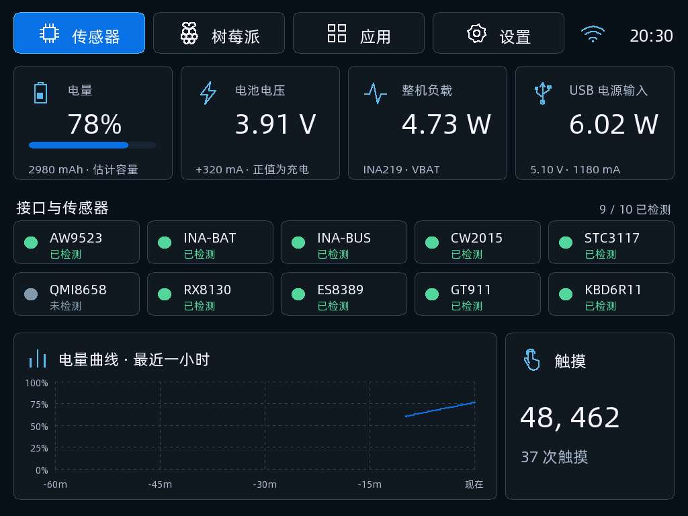
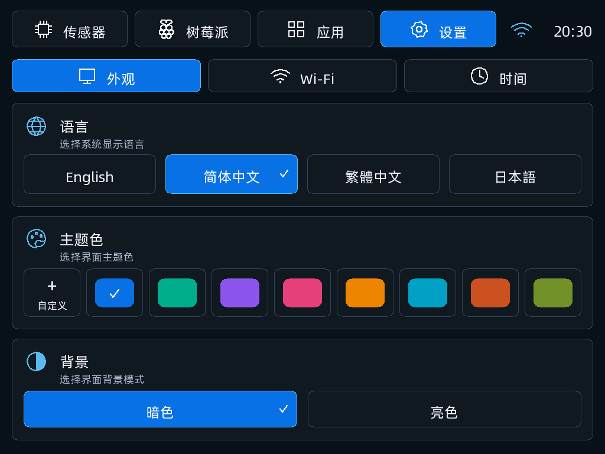
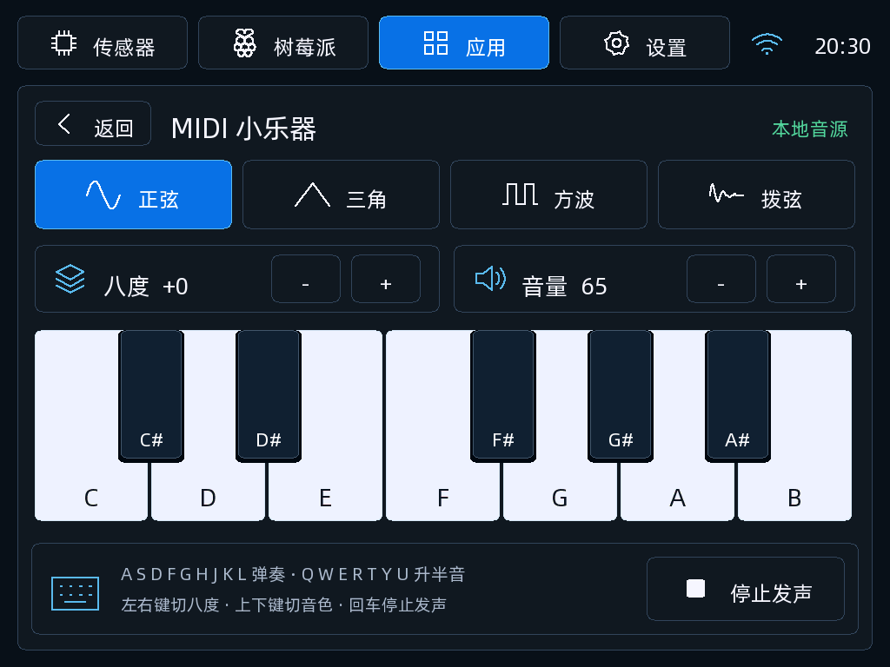

# TypixDeck DIY 0.3.0

参考传感器、设置和小乐器设计图重做原生界面，适配 TypixDeck 板载 ESP32-S3 的 1024 × 768 屏幕。基于 ESP-IDF 5.5.1，已完成本机组件测试、实际绘图代码渲染和固件编译，**尚未刷入真机验证**。

- 传感器：四张电池/电源卡片、实际接口检测数量、一小时电量曲线和触摸状态。缺失数据保留空缺，短时间采样不拉伸成一小时。
- 设置：外观、Wi-Fi、时间；八种预设主题色、自定义 RGB、亮暗背景，支持触摸和键盘操作及保存。未覆盖的翻译或字形回退为可显示的文字。
- 小乐器：七个白键和五个黑键，支持触摸滑奏、键盘弹奏、按住反馈、四种本地音色、八度与音量调节。音源仍为本地合成，不提供 USB/BLE MIDI 或完整 GM 音源。
- 树莓派与时钟沿用统一布局；未知 HDMI FPS 显示缺省值，硬启动和深度休眠尚未开放。

## 界面预览

以下图片由实际 `ui.c` / `ttf_font.c` 在电脑上绘制，数值来自测试数据，**不是真机截图**。渲染源码摘要见 [screenshots/manifest.json](screenshots/manifest.json)。





[亮色背景](screenshots/settings-light.png) · [自定义 RGB](screenshots/settings-custom-dark.png)

## 镜像与来源

`typixdeck-diy-0.3.0-full.bin` 包含 bootloader、分区表、应用和字体，描述偏移为 `0x0`。采用 8 MiB Flash、2 MiB factory 和 4 MiB font 布局，头部 DIO/80 MHz。完整写入覆盖 NVS，清除偏好及已保存的 Wi-Fi 设置。发布产物的 NVS 区间为空白，不含设备备份或用户凭据。

大小：`3997320` 字节。SHA-256：

```text
bceb894b1bddc09b556ddb5da9866b661ab9dee172d74d7026c3779fcd0dee6d
```

源码基于 [TypixNode 官方工程](https://github.com/TypixNode/TypixDeck-esp32s3-firmware/tree/fde9dac3b687a92fa2a6a049b5cd953dcb367b23)，应用改造来自本地 `diy-esp32s3-firmware` 工作副本。该候选尚无对应的改造源码提交，因此索引 `commit` 留空；上游提交不代表此产物的可重复构建证明。Copilot 0.2.0 验证签名目录后可直接发起写入，自动下载或复用缓存；这不代表已完成真机验收。保留 [0.2.0](../0.2.0/) 供版本对照。

上游工程 MIT、ESP-IDF Apache 2.0、TinyUSB MIT、FreeType FTL 与 Special Elite Apache 2.0 声明保留在 [licenses/](licenses/)。本软件部分基于 FreeType 团队的工作。字体资源包含上游提供的阿里巴巴普惠体子集，使用和分发须遵守其字体许可；这些第三方资源不因本目录发布而改为项目许可。
