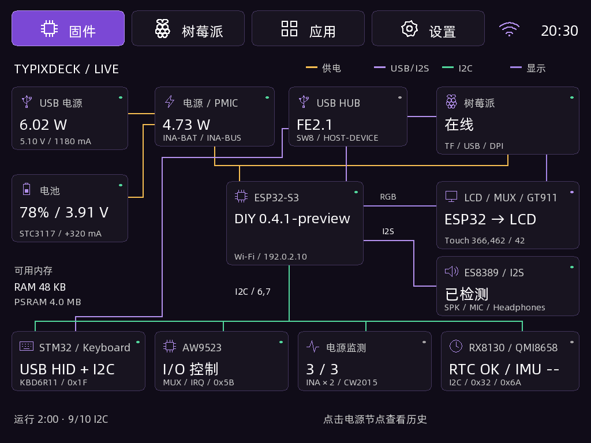
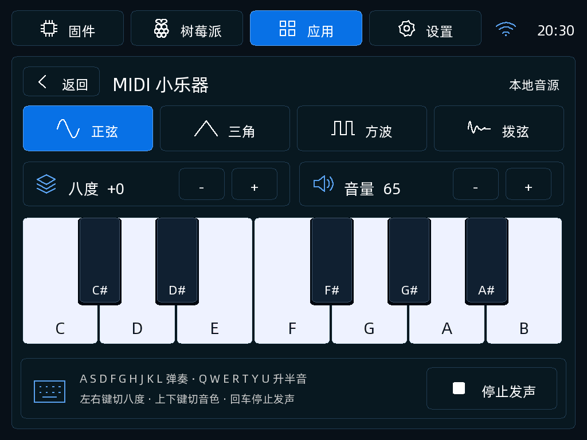

# TypixDeck DIY 0.4.1 预发布版

固件首页改为可点击连接拓扑，展示组件状态和功耗历史；树莓派页面提供配对 HTTPS 状态、只读文件与截图。保留小乐器、时钟、实体键盘输入、Wi-Fi/NTP 与主题色设置。本版修正小乐器双重音量衰减、HTTPS 连接/超时处理、主题色背景/边框，并新增电量计诊断。

**尚未完成 0.4.1 真机写入和整机验收；电量 0% 问题尚未修复。** Copilot 完整备份/写入/回读链路仍在验证。签名和哈希证明发布文件的身份，不表示硬件验收通过。

[固定源码提交](https://github.com/typixdeck/diy-esp32s3-firmware/tree/3a377c85d6ee891522263ef96f306eddfeab7e64) · [发布说明与应用镜像](https://github.com/typixdeck/diy-esp32s3-firmware/releases/tag/v0.4.1) · [Pi 服务安装与配对](https://github.com/typixdeck/diy-esp32s3-firmware/blob/3a377c85d6ee891522263ef96f306eddfeab7e64/host/README.md)

## 界面预览

实际固件绘图代码在电脑上使用测试数据生成，**不是真机截图**。渲染摘要见 [screenshots/manifest.json](screenshots/manifest.json)。

[树莓派状态](screenshots/pi-dark.png) · [亮色设置](screenshots/settings-light.png)

## 镜像

`typixdeck-diy-0.4.1-full.bin`：3997320 字节，写入地址 `0x0`，8 MiB Flash / 8 MiB PSRAM，factory 2 MiB / font 4 MiB。ESP-IDF 5.5.1 构建，含 bootloader、分区表、应用及字体。NVS 区域为空白，没有设备备份或个人配置。**完整写入覆盖 NVS，需要重新配置 Wi-Fi、配对和偏好。**

SHA256：`c72336499a47a8316bc02594e4de9dd46052c2099df2ef796e353d7e7de99903`

Copilot 刷新目录后选择本版本，点击“写入”即可按需下载或复用缓存，并继续授权与板级检查。旧版本保留在各自版本目录中。

第三方声明见 [licenses/](licenses/)。上游工程 MIT、ESP-IDF Apache 2.0、TinyUSB MIT、FreeType FTL、Special Elite Apache 2.0；本软件部分基于 FreeType 团队的工作。阿里巴巴普惠体子集沿用上游字体许可，不因本目录发布而更换许可。
