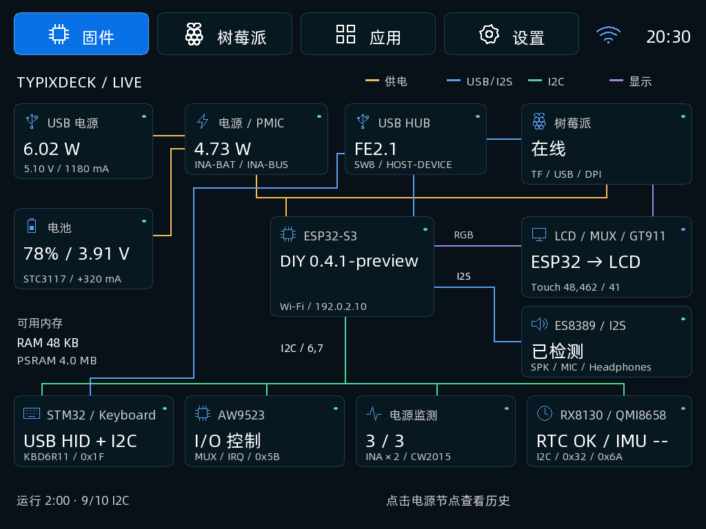

# TypixDeck DIY 0.4.2 电量修正预发布版

参考 [LiJinLiJin 的 STC3117 优化](https://gitcode.com/LiJinLiJin/stc3117-fuel-gauge)，补齐电量计初始化并加入持续满充判定。切屏保留正常计数和系数，故障、冻结及过期读数显示未知。保留连接拓扑、Pi 共享、小乐器和主题设置。

**尚未刷入真机或进行充放电、双主控验收，`hardware_verified=false`。** 原装电池参考参数为 604070 / 2400 mAh / 4.2 V；内阻 140 mΩ 为上游参考值。没有启用自动改写容量系数，也不会通过软复位掩盖欠压或电池故障。

[固定源码提交](https://github.com/typixdeck/diy-esp32s3-firmware/tree/5435cf004d43b7a16fd55034a348a5dbca6d069e) · [电量实现与验收条件](https://github.com/typixdeck/diy-esp32s3-firmware/blob/5435cf004d43b7a16fd55034a348a5dbca6d069e/docs/battery.md) · [发布说明及 app 镜像](https://github.com/typixdeck/diy-esp32s3-firmware/releases/tag/v0.4.2)

## 界面参考

界面布局沿用 0.4.1；以下图片是该版生产绘图代码使用测试数据生成的预览，**不是电池实测结果**。

## 镜像

`typixdeck-diy-0.4.2-full.bin`：3997320 字节，地址 `0x0`，8 MiB Flash / 8 MiB PSRAM，factory 2 MiB / font 4 MiB。来自 ESP-IDF 5.5.1 源码构建，无设备备份或个人数据。**完整写入覆盖 NVS，需要重新配置 Wi-Fi、配对和偏好。**

SHA256：`eb5f61f054f49837345e0058b70565c16ae3e7733fcd2ed88bad0b3389c49c20`

Copilot 0.2.5 刷新目录后选择 0.4.2 即可按需下载并发起写入，不需要更新客户端版本白名单；签名与哈希仍须校验。旧 0.4.1 产物与哈希不变。切回 ESP 后待两次 5 s 采样确认计量器在运行，期间显示 `--`。

第三方许可见 [licenses/](licenses/)。该固件未包含朋友的 Linux GPL 驱动代码；算法策略独立实现，原装电芯曲线和共享 RAM 格式沿用 TypixNode MIT 固件。
