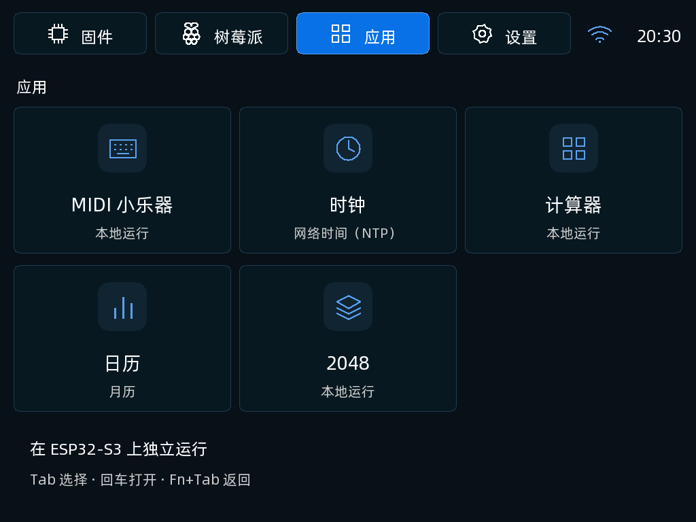
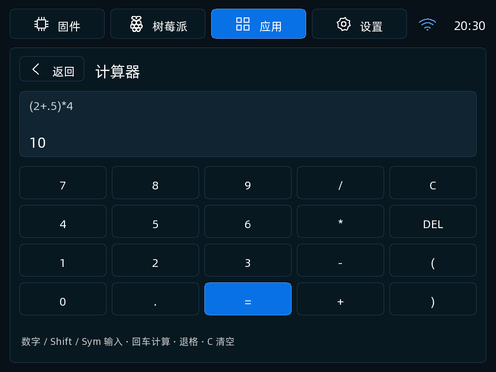
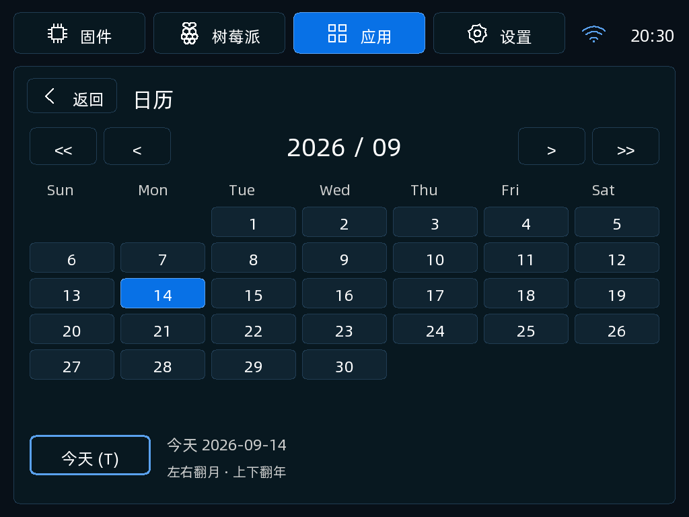
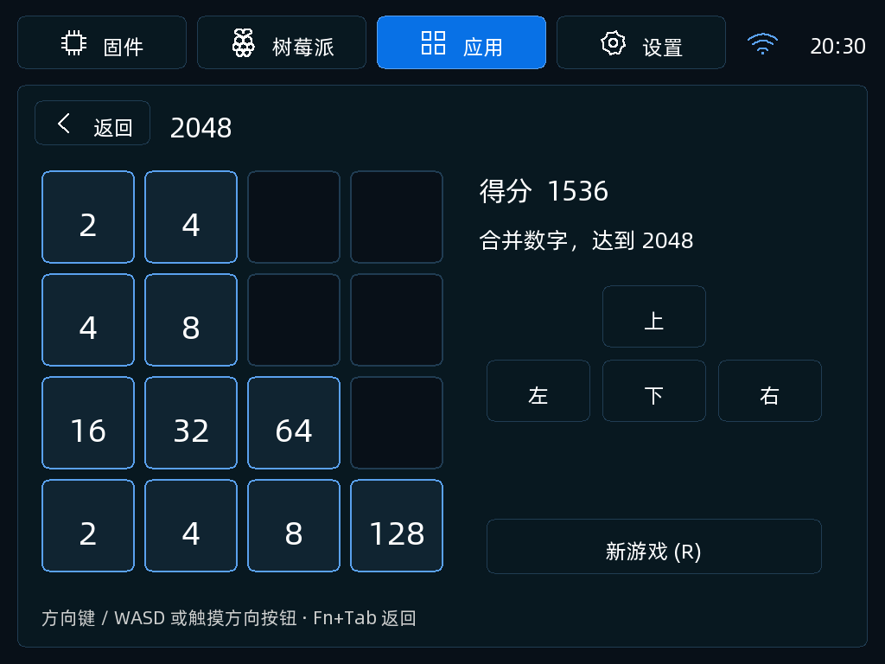

# TypixDeck DIY 0.4.3 内置应用预发布版

新增计算器、日历和 2048；保留 MIDI、时钟、电量修正、连接拓扑和 Pi 配对共享。三个新应用支持触摸与实体键盘，使用固定大小内存，无新增后台任务或网络依赖。

[固定源码](https://github.com/typixdeck/diy-esp32s3-firmware/tree/b49ada77178e0caf5303141cb0decc6dc62b50b8) · [操作说明](https://github.com/typixdeck/diy-esp32s3-firmware/blob/b49ada77178e0caf5303141cb0decc6dc62b50b8/docs/builtin-apps.md) · [发布说明和应用镜像](https://github.com/typixdeck/diy-esp32s3-firmware/releases/tag/v0.4.3)

独立检查已验证运算边界、公历与时区、2048 合并规则、触摸/键盘事件路由、ASan/UBSan 和 ESP-IDF 5.5.1 构建。**本版没有刷入设备，`hardware_verified=false`；触摸手感和长时间运行仍待真机验证。** 没有修改驱动、分区、USB、供电或 MUX。

## 界面

以下由本版 C 绘图代码和合成状态生成，不是真机截图。

## 镜像

`typixdeck-diy-0.4.3-full.bin`：3997320 字节，地址 `0x0`，8 MiB Flash / 8 MiB PSRAM，factory 2 MiB / font 4 MiB。SHA256：`9d0fdb7c7ce0001063bd451effbbd0c3b08b4230f7cbfc4244b8db183672a9f9`。

完整写入覆盖 NVS，需要重新配置 Wi-Fi、配对和偏好。文件是无设备数据的源码构建产物。应用镜像位于上面的 Release，仅可用于已匹配的分区与字体布局。许可见 [licenses/](licenses/)。

在现有 Copilot 刷新签名目录后选择 0.4.3，点击“写入”即可按需下载、校验并发起正常授权流程；无需更新客户端版本白名单。旧版文件与哈希保持不变。
